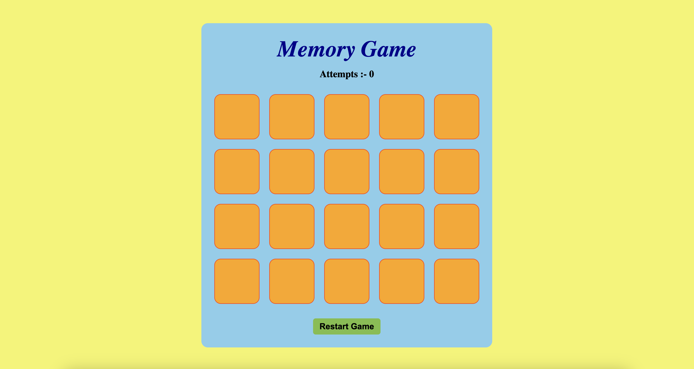

# Match The Pair - Memory Game

This is a simple "Match The Pair" memory game where players need to find pairs of matching cards by flipping them. The game keeps track of the number of attempts, and it can be restarted at any time.

## Screenshort



## Features

- **Shuffle Cards:** Every time the game starts or restarts, the cards are shuffled randomly.
- **Flip Cards:** Click on the cards to reveal their content.
- **Match Pairs:** If two revealed cards match, they stay visible; otherwise, they flip back.
- **Attempts Counter:** Displays the number of attempts made.
- **Restart Game:** Players can restart the game at any time, which resets the board and attempts counter.

## Technologies Used

- **HTML** for structuring the content.
- **CSS** for styling the game layout.
- **JavaScript** for game logic (shuffling cards, revealing cards, matching pairs, and restarting the game).

## How to Play

1. Open the game in your browser.
2. Click on any two cards to reveal their symbols.
3. If the cards match, they stay revealed; otherwise, they flip back.
4. Continue flipping and matching pairs of cards.
5. The game ends when all pairs are matched, and you will receive a congratulatory message with your total attempts.
6. Click the "Restart Game" button to shuffle the cards and play again.

## File Structure

```bash
.
├── index.html         # The main HTML structure of the game.
├── style.css          # The CSS file to style the game.
├── script.js          # The JavaScript file containing the game logic.
└── README.md          # This readme file.
```

## Customization

Feel free to modify the game by:

* Adding more cards to the cardsArray in script.js.
* Changing the colors and layout in style.css.
* Adjusting the grid layout for different screen sizes using media queries.

## Installation and Setup
To run this game locally:

* Clone this repository or download the project files.
* Open index.html in your web browser.

## Hosted Link
 [Play Match The Pair Game]( https://lovenoelkujur.github.io/Match-pair-MCT/)

## License
This project is open source and available under the MIT License.